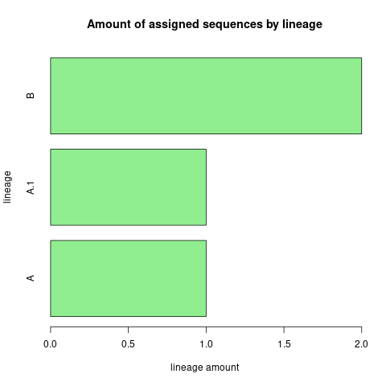

# NewDataProcessProject

2023-2024 data-process pipeline-conversion project; Adapting havoc to utilise snakemake.

For the Data Processing class of BFV3 2023-2024, the students of Hanze University of
Applied Sciences were tasked with adapting a  pipeline developed by a third party using bash,
into a pipeline with a similar execution and result, however using the snakemake workflow
management system instead. This specific project aims to adapt the Helsinki university
Analyzer for Variants of Concern (HAVoC), a bioinformatic pipeline for reference-based
consensus assembly and lineage assignment for SARS-CoV-2 sequences.


## Installation

It is strongly recommended for the user to have either Conda or Mamba installed,
which will make installing snakemake a smoother process. Directions on how to
install Conda can be found on their official website respectively:

https://conda.io/projects/conda/en/latest/user-guide/install/index.html

Once the user has installed a Conda-based Python3 distribution, the user must 
first create the conda environment using the environment.yml file. This file can
be found within this project's main directory:
```
conda env create -f environment.yml
```
Next, activate the environment with:
```
conda activate myenv
```
Where "myenv" is the name of the new environment. If the user wishes to see a list of environments,
they must use the following command:
```
conda env list
```
Further commands and options for conda can be found on the official Conda website respectively.


## Usage

Once Installations are complete, simply run the program from the proper directory with the following command:
```
snakemake -c --use-conda
```
where -c indicated the amount of cores the user wishes to use, and --use-conda ensures the correct environment
is used for each step. WARNING: If --use-conda is not added, the lineage step will fail! If the user wishes to 
perform a dry-run, they can add -n to the command. further options can be found on the snakemake official website:

https://snakemake.readthedocs.io/en/v5.6.0/executable.html

After execution of the pipeline, the user ends up with a visual representation of the amount of sequences
assigned to a specific lineage. Lineages are assigned according to pangolin designation. Full names and descriptions
of each assigned lineage can be found on the following github page:

https://github.com/cov-lineages/pango-designation/blob/master/lineage_notes.txt

an example of the outputted png file:



## Contact

This pipeline was developed by Wisse Schuuring, student at Hanze university of applied sciences in 2023-2024.
If you have any inquires or questions, feel free to contact me by mail at:

- mail: w.s.f.schuuring@st.hanze.nl
- repository: https://github.com/WisseSchuuring
