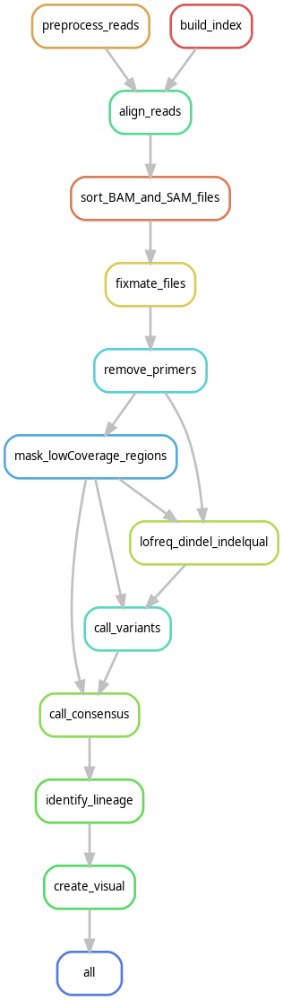

# NewDataProcessProject

2023-2024 data-process pipeline-conversion project; Adapting havoc to utilise snakemake.

For the Data Processing class of BFV3 2023-2024, the students of Hanze University of
Applied Sciences were tasked with adapting a  pipeline developed by a third party using bash,
into a pipeline with a similar execution and result, however using the snakemake workflow
management system instead. This specific project aims to adapt the Helsinki university
Analyzer for Variants of Concern (HAVoC), a bioinformatic pipeline for reference-based
consensus assembly and lineage assignment for SARS-CoV-2 sequences.

## Steps

This adaptation of Havoc performs the following steps in order:
1. Preprocess reads: changing the raw data provided into a cleaner data set
2. Align reads: aligning the reads with the reference fasta provided by the user
3. Process SAM and BAM files: Fill in mate coordinates
4. Remove primers: removes the primers from the sequence using the user provided primers
5. Mask low-coverage regions: masks sequences in the FASTA file
6. Insertion/deletion quality (indelqual): calls insertions or deletions in the masked file
7. Variant calling: calls variants found in the sequence
8. Consensus calling: after variants are called, creates the consensus sequence to be designated
9. Lineage identification: identifies which Cov lineage the consensus sequence aligns to most using pangolin
10. Create visual: creates a visual representation of the sequences and their assigned lineage in the form of a bar plot



## Installation

It is strongly recommended for the user to have either Conda or Mamba installed,
which will make installing snakemake a smoother process. Directions on how to
install Conda can be found on their official website respectively:

https://conda.io/projects/conda/en/latest/user-guide/install/index.html

To install this program, first the user must clone the repository:
```
git clone https://github.com/yourusername/NewDataProcessProject.git
cd NewDataProcessProject
```

the user must create the conda environment using the environment.yml file. This file can
be found within this project's main directory:
```
conda env create -f environment.yml
```

Next, activate the environment with:
```
conda activate myenv
```
Where "myenv" is the name of the new environment. If the user wishes to see a list of environments,
they must use the following command:
```
conda env list
```
Further commands and options for conda can be found on the official Conda website respectively.

## Config

The configuration file config.yaml defines the location of all files necessary for the proper execution
of this pipeline. it contains the following:
- datadir: The path to the directory containing the input files
- outputdir: The path to the directory where all output will be written to
- reference: The name and location of the reference fasta file
- primers: The name and location of the primers bed file
- R1: The name of the Read 1 sequence
- R2: The name of the Read 2 sequence

The user can edit these configurations freely, as long as all path and filenames are filled in. 

## Usage

The user must provide two or more Cov sequences in fasta format, and place them in the data/fastq_files directory
located in NewDataProcessProject. Furthermore, a reference sequence must be provided and placed within the directory.
Lastly, a file containing the associated primers must be provided. The locations of these files must be specified
in the configuration file "config.yaml".

Once Installations are complete, simply run the program from the proper directory with the following command:
```
snakemake -c --use-conda
```
where -c indicated the amount of cores the user wishes to use, and --use-conda ensures the correct environment
is used for each step. WARNING: If --use-conda is not added, the lineage step will fail! If the user wishes to 
perform a dry-run, they can add -n to the command. further options can be found on the snakemake official website:

https://snakemake.readthedocs.io/en/v5.6.0/executable.html

After execution of the pipeline, the user ends up with a visual representation of the amount of sequences
assigned to a specific lineage. Lineages are assigned according to pangolin designation. Full names and descriptions
of each assigned lineage can be found on the following github page:

https://github.com/cov-lineages/pango-designation/blob/master/lineage_notes.txt

an example of the outputted png file:


## Contact

This pipeline was developed by Wisse Schuuring, student at Hanze university of applied sciences in 2023-2024.
If you have any inquires or questions, feel free to contact me by mail at:

- mail: w.s.f.schuuring@st.hanze.nl
- repository: https://github.com/WisseSchuuring
